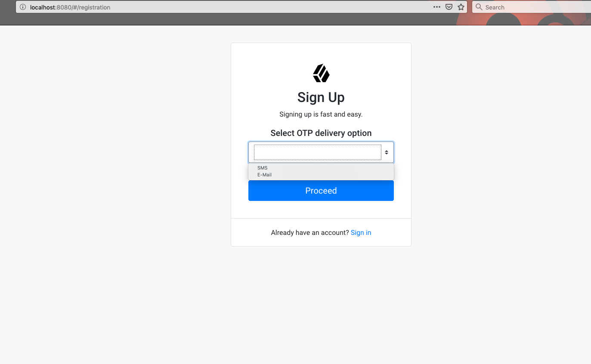

# IDM-ChoiceStage

IDM custom self-service stage sample to select required OTP delivery option like SMS or Email etc  

Disclaimer of Liability :
=========================
The sample code described herein is provided on an "as is" basis, without warranty of any kind, to the fullest extent permitted by law. 
ForgeRock does not warrant or guarantee the individual success developers may have in implementing the sample code on their development platforms 
or in production configurations.

ForgeRock does not warrant, guarantee or make any representations regarding the use, results of use, accuracy, timeliness or completeness of any data 
or information relating to the sample code. ForgeRock disclaims all warranties, expressed or implied, and in particular, disclaims all warranties of 
merchantability, and warranties related to the code, or any service or software related thereto.

ForgeRock shall not be liable for any direct, indirect or consequential damages or costs of any type arising out of any action taken by you or others 
related to the sample code.

Pre-requisites :
================
* Versions used for this project: IDM 6.5
1. IDM has been installed and configured.

IDM UI:
=====================
1. Refer instructions: *[How to Add a Self-Service Stage to the UI](https://github.com/ForgeRock/end-user-ui#how-to-add-a-self-service-stage-to-the-ui)* for general instructions on implementing UI for custom stage.
2. Refer sample code under end-user-ui for files that are required to be changed for adding "Choice stage".
3. Build modified UI as per *[How to Add Additional Registration Flows](https://github.com/ForgeRock/end-user-ui#how-to-replace-idm-end-user)*

IDM Configuration:
=====================
1. *[Build and deploy choice self-service stage](https://backstage.forgerock.com/docs/idm/6.5/self-service-reference/#custom-stage-building)*. 
2. *[Test choice self-service stage](https://backstage.forgerock.com/docs/idm/6.5/self-service-reference/#custom-stage-testing)*. Refer conf/selfservice-registration.json for sample configuration.  

IDM testing:
=========================
1. Choice self-service stage shall be displayed during registration flow, refer below image:

   
        
* * *

The contents of this file are subject to the terms of the Common Development and
Distribution License (the License). You may not use this file except in compliance with the
License.

You can obtain a copy of the License at legal/CDDLv1.0.txt. See the License for the
specific language governing permission and limitations under the License.

When distributing Covered Software, include this CDDL Header Notice in each file and include
the License file at legal/CDDLv1.0.txt. If applicable, add the following below the CDDL
Header, with the fields enclosed by brackets [] replaced by your own identifying
information: "Portions copyright [year] [name of copyright owner]".

Copyright 2019 ForgeRock AS.

Portions Copyrighted 2018 Charan Mann
